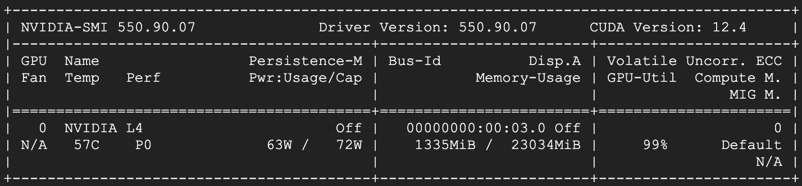
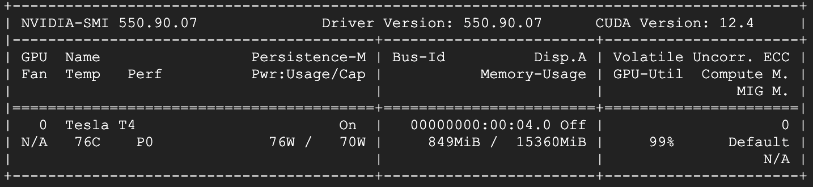

# Design

- **Semi-fixsliced** ShiftRows used.
- **GPU:** Enable in Cargo.toml and build with flag '--features gpu'.

# References
- [Fixslicing AES-like Ciphers](https://eprint.iacr.org/2020/1123.pdf)
- [NIST FIPS 197 (Original)](https://nvlpubs.nist.gov/nistpubs/fips/nist.fips.197.pdf)
- [NIST FIPS 197 (Update 1)](https://nvlpubs.nist.gov/nistpubs/FIPS/NIST.FIPS.197-upd1.pdf)
- [NIST Special Publication 800-38A](https://nvlpubs.nist.gov/nistpubs/legacy/sp/nistspecialpublication800-38a.pdf)

# GPU trials
| Stage        | NVIDIA L4        | NVIDIA T4        |
|--------------|------------------|------------------|
| ark time     | 5.23 s           | 8.23 s           |
| sbox time    | 65.24 s          | 102.90 s         |
| shiftrows    | 99.68 ms         | 96.34 ms         |
| mixcols time | 14.01 s          | 22.17 s          |
| out time     | 93.02 s          | 138.10 s         |

| Test setup   | Data                             |
|--------------|----------------------------------|
| plaintext    | 00112233445566778899aabbccddeeff |
| key          | 000102030405060708090a0b0c0d0e0f |
| cloud AES    | 69c4e0d86a7b0430d8cdb78070b4c55a |

## nvidia-smi monitoring
L4

T4

