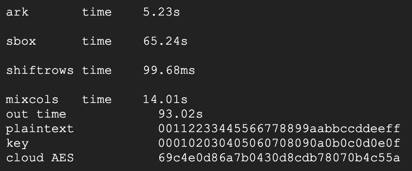
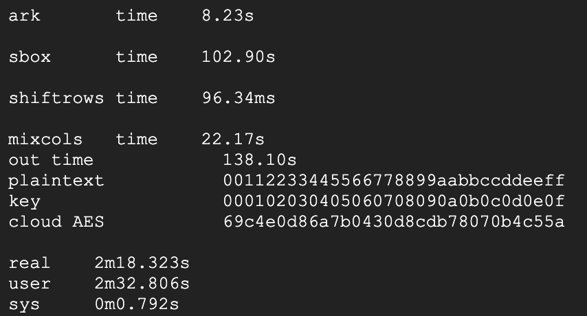
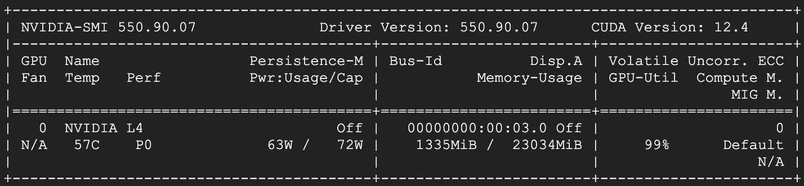
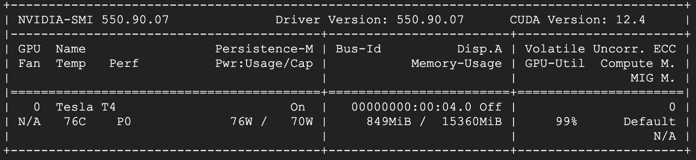

# Design

- **GPU:** Enable in Cargo.toml and build with flag '--features gpu'.

# References
- [Fixslicing AES-like Ciphers](https://eprint.iacr.org/2020/1123.pdf)
- [NIST FIPS 197 (Original)](https://nvlpubs.nist.gov/nistpubs/fips/nist.fips.197.pdf)
- [NIST FIPS 197 (Update 1)](https://nvlpubs.nist.gov/nistpubs/FIPS/NIST.FIPS.197-upd1.pdf)
- [NIST Special Publication 800-38A](https://nvlpubs.nist.gov/nistpubs/legacy/sp/nistspecialpublication800-38a.pdf)

# GPU trials
1 x NVIDIA L4

1 x NVIDIA T4

## nvidia-smi monitoring
L4

T4

